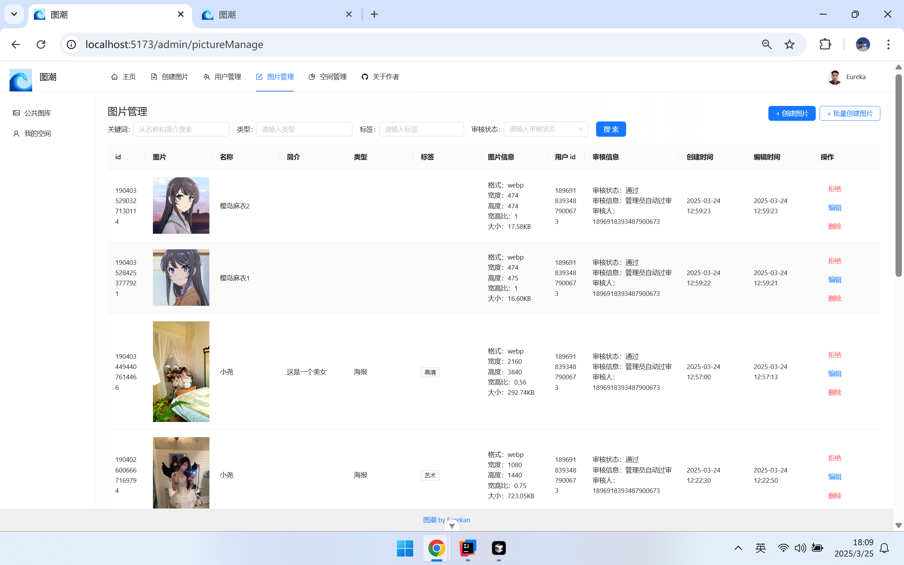
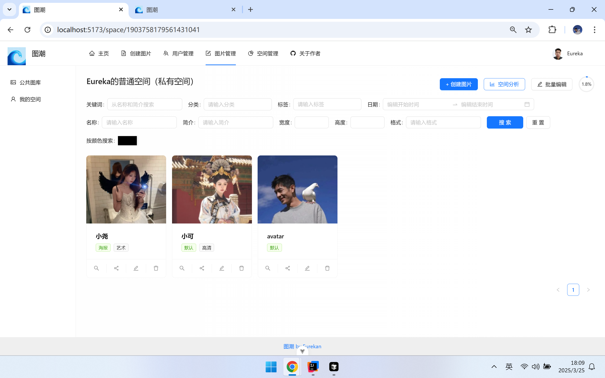
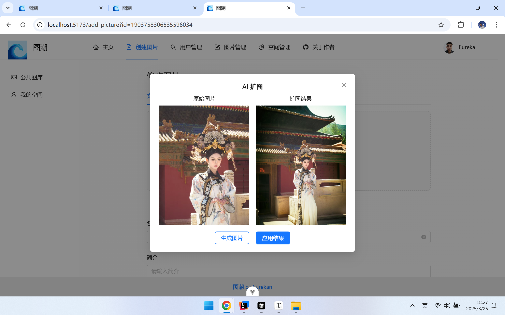

# 图潮

## 项目介绍

基于 Vue 3 + Spring Boot + COS 的 **AI 云图库平台**

核心功能可分为 3 大类

1）所有用户都可以在平台公开上传和检索图片素材，快速找到需要的图片。可用作表情包网站、设计素材网站、壁纸网站等：

2）管理员可以上传、审核和管理图片，并对系统内的图片进行分析：

3）对于个人用户，可将图片上传至私有空间进行批量管理、检索、编辑和分析，用作个人网盘、个人相册、作品集等：

## 项目亮点

### 图片编辑

### 图片分享

### 图库分析

### 以图搜图

### 颜色识图

### AI 扩图

## 技术选型

* Java Spring Boot 框架
* MySQL 数据库 + MyBatis-Plus 框架 + MyBatis X
* Redis 分布式缓存 + Caffeine 本地缓存
* Jsoup 数据抓取
* ⭐️ COS 对象存储
* ⭐️ JUC 并发和异步编程
* ⭐️ AI 绘图大模型接入
* ⭐️ 多种设计模式的运用
* ⭐️ 多角度项目优化：性能、成本、安全性等
